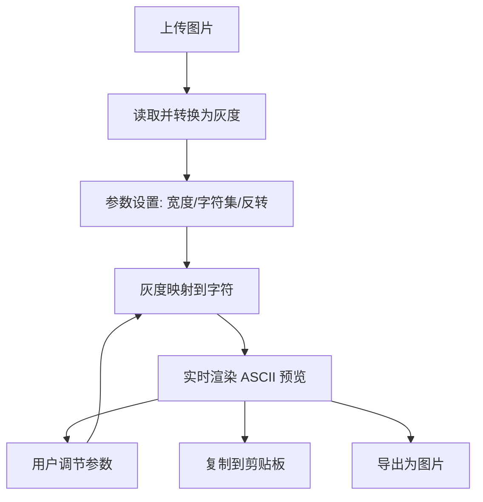

## 1. 产品概述

ASCII 艺术生成器是一个纯前端工具，可将用户上传的图片转换为字符艺术。通过灰度映射算法将像素亮度转换为对应密度的字符，支持多种参数调节和导出方式，为创意设计、社交媒体分享和打印需求提供服务。

- 核心目标：提供简单易用的图片转 ASCII 艺术工具，支持实时预览和多种导出格式
- 目标用户：设计师、程序员、社交媒体用户、复古艺术爱好者

## 2. 核心功能

### 2.1 用户角色

| 角色 | 注册方式 | 核心权限 |
|------|----------|----------|
| 普通用户 | 无需注册 | 使用全部功能，上传图片并生成 ASCII 艺术 |

### 2.2 功能模块

1. **控制面板**：图片上传、参数调节、字符集选择
2. **实时预览区**：ASCII 艺术实时渲染展示
3. **操作区**：复制文本、导出图片功能

### 2.3 页面详情

| 页面名称 | 模块名称 | 功能描述 |
|----------|----------|----------|
| 主页 | 控制面板 | 图片拖拽/点击上传，宽度滑块调节，字符集下拉选择，反转开关 |
| 主页 | 预览区域 | 显示原始图片缩略图和生成的 ASCII 艺术文本，支持滚动查看 |
| 主页 | 操作按钮 | 一键复制 ASCII 文本到剪贴板，导出为等宽字体图片 |

## 3. 核心流程

用户上传图片 → 系统读取图片并转换为灰度数据 → 根据参数（宽度、字符集、反转）实时计算 ASCII 字符 → 在预览区渲染展示 → 用户调节参数时实时更新 → 用户复制文本或导出图片

## 4. 用户界面设计

### 4.1 设计风格

- **主色调**：深黑色背景 (#0a0a0a)，绿色荧光文字 (#39ff14)
- **辅助色**：暗绿色边框 (#1a4d1a)，琥珀色状态指示 (#ffaa00)
- **按钮风格**：复古工业风，立体边框，点击凹陷效果
- **字体**：等宽字体 (Courier New, monospace) 用于 ASCII 预览区，复古电子字体用于控制面板标签
- **布局风格**：控制面板位于左侧或顶部，预览区域占据主要空间，边框采用虚线或点阵风格模拟老式打印机
- **装饰元素**：闪烁的光标、状态指示灯、模拟打印机噪音的轻微动画

### 4.2 页面设计概述

| 页面名称 | 模块名称 | UI 元素 |
|----------|----------|----------|
| 主页 | 控制面板 | 绿色荧光文字标签、工业风滑块、复古按钮、点阵边框、状态指示灯 |
| 主页 | 预览区域 | 黑底绿字等宽字体展示、滚动条定制、字符间距精确控制 |
| 主页 | 操作区 | 大型复古按钮，带 LED 状态指示 |

### 4.3 响应式

- 桌面端优先设计，控制面板左侧布局，预览区右侧
- 移动端自适应为上下布局，控制面板在上，预览区在下
- 触摸设备优化滑块和按钮的点击区域

### 4.4 动画效果

- 页面加载时模拟打印机启动的逐行显示动画
- 参数调节时预览区平滑过渡更新
- 按钮点击有"咔嗒"凹陷效果
- 状态指示灯有呼吸闪烁效果
