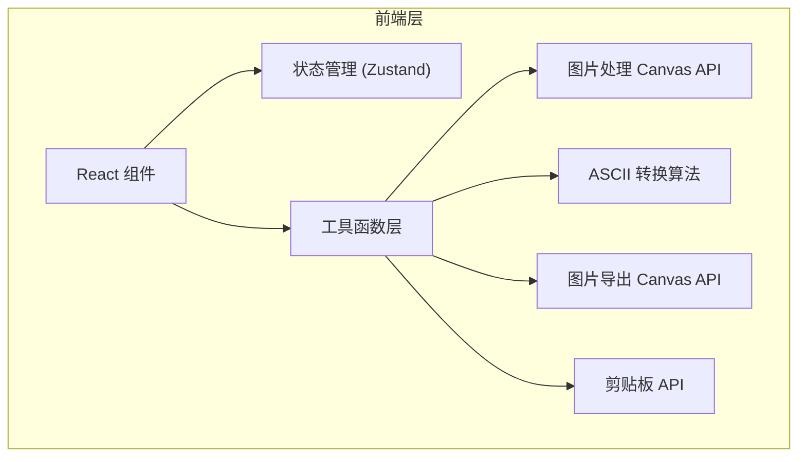

## 1. 架构设计



## 2. 技术描述

- **前端**：React@18 + TypeScript + Vite + TailwindCSS@3 + Zustand
- **初始化工具**：vite-init
- **后端**：无（纯前端应用）
- **数据库**：无

## 3. 目录结构

```
src/
├── components/
│   ├── ControlPanel.tsx      # 控制面板组件
│   ├── ImageUploader.tsx     # 图片上传组件
│   ├── AsciiPreview.tsx      # ASCII 预览组件
│   ├── ActionButtons.tsx     # 操作按钮组件
│   └── StatusIndicator.tsx   # 状态指示组件
├── hooks/
│   ├── useAsciiGenerator.ts  # ASCII 生成逻辑 hook
│   └── useImageProcessor.ts  # 图片处理 hook
├── utils/
│   ├── asciiConverter.ts     # ASCII 转换算法
│   ├── charSets.ts           # 字符集定义
│   └── imageExporter.ts      # 图片导出工具
├── store/
│   └── useAppStore.ts        # 全局状态管理
├── types/
│   └── index.ts              # 类型定义
├── App.tsx
├── main.tsx
└── index.css
```

## 4. 路由定义

| 路由 | 用途 |
|------|------|
| / | 主页，包含全部功能 |

## 5. 核心数据结构

### 5.1 应用状态

```typescript
interface AppState {
  image: HTMLImageElement | null;
  imageData: ImageData | null;
  asciiText: string;
  settings: {
    width: number;
    charSet: string;
    customChars: string;
    invert: boolean;
  };
  status: 'idle' | 'processing' | 'ready' | 'error';
}
```

### 5.2 字符集定义

```typescript
const CHAR_SETS = {
  standard: '@%#*+=-:. ',           // 标准密度
  minimal: '@#. ',                  // 极简
  programming: '$@B%8&WM#*oahkbdpqwmZO0QLCJUYXzcvunxrjft/|()1{}[]?-_+~<>i!lI;:,"^`\'. ',
  blocks: '█▓▒░ ',                   // 方块字符
};
```

## 6. 核心算法

### 6.1 灰度转 ASCII 算法

```typescript
function grayscaleToAscii(gray: number, charSet: string, invert: boolean): string {
  const normalized = invert ? (255 - gray) / 255 : gray / 255;
  const index = Math.floor(normalized * (charSet.length - 1));
  return charSet[index];
}
```

### 6.2 图片缩放算法

根据用户设定的输出宽度，按比例计算高度（考虑字符宽高比约为 1:2），使用 Canvas API 进行图片缩放和像素读取。

### 6.3 图片导出算法

使用 Canvas API 绘制等宽字体文本，支持自定义背景色和文字颜色，导出为 PNG 格式。
